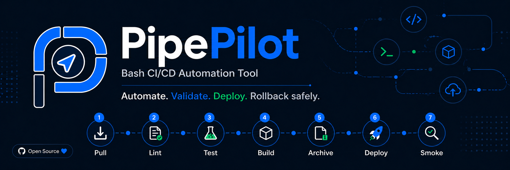

# PipePilot



**Automate. Validate. Deploy. Rollback safely.**

PipePilot is a Bash-powered CI/CD deployment assistant for frontend and backend
projects. It runs the full release path from source recovery to smoke testing,
can prepare a fresh Linux server over SSH, and can start Python or Node.js
backends as managed services.

## Why PipePilot

PipePilot is built for small teams, VPS deployments, internal tools, and
lightweight production workflows where a full CI/CD platform would be too heavy.
It keeps the deployment process visible and scriptable while still handling the
repetitive parts: builds, archives, server setup, file transfer, service
restart, smoke checks, and rollback.

## Pipeline

Every run follows the same seven-step pipeline:

```text
Pull -> Lint -> Test -> Build -> Archive -> Deploy -> Smoke Test
```

If a deployment or smoke test fails, PipePilot logs the failure and attempts to
restore the latest archive.

## Features

- Frontend deployment with automatic `dist/`, `build/`, or `public/` upload.
- Backend deployment for Python and Node.js projects.
- Smart fresh-server setup through SSH with `--setup-server`.
- Automatic backend dependency installation after upload.
- Automatic backend service creation with systemd.
- Python backend start detection for FastAPI, Flask, `app.py`, and `main.py`.
- Node.js backend start detection for `npm start`, `server.js`, `app.js`,
  `index.js`, and `main.js`.
- Remote transfer through `rsync` or `scp`.
- nginx setup for frontend hosting and backend reverse proxying.
- Structured deployment logs in `history.log`.
- Timestamped rollback archives.
- Dry-run mode for safe production simulation.
- Sequential, subshell, fork, and background-job execution modes.
- Semantic versioning with release tags.

## Requirements

Local machine:

- Bash
- Git
- SSH client
- `rsync` or `scp` for remote deployment
- Node.js/npm for Node projects
- Python 3 for Python projects
- Optional terminal logo renderers: `chafa`, `viu`, `imgcat`, Kitty, WezTerm,
  or ImageMagick

Remote server:

- Linux with SSH access
- A user with permission to create the target directory
- `sudo` access when using `--setup-server` for package installation, nginx, or
  systemd service creation

## Installation

```bash
git clone https://github.com/simoderyouch/PipePilot.git
cd PipePilot
chmod +x pipepilot
./pipepilot --version
```

## Quick Start

Run a local staging deployment:

```bash
./pipepilot -p /path/to/app -e staging -v
```

Preview a production deployment without changing anything:

```bash
./pipepilot -d -p /path/to/app -e production -v
```

Show all options:

```bash
./pipepilot -h
```

## Frontend Deployment

Deploy an already configured frontend project:

```bash
./pipepilot \
  -p ./frontend \
  -e production \
  --remote \
  --host myserver.com \
  --user ubuntu \
  --key ~/.ssh/server_key.pem \
  --target /var/www/frontend \
  --deploy-dir dist \
  --build-cmd "npm run build" \
  --url https://myserver.com
```

Prepare a fresh server, install nginx, upload `dist/`, and configure the domain:

```bash
./pipepilot \
  -p ./frontend \
  -e production \
  --remote \
  --setup-server \
  --app-kind frontend \
  --host myserver.com \
  --user ubuntu \
  --key ~/.ssh/server_key.pem \
  --target /var/www/frontend \
  --deploy-dir dist \
  --domain myserver.com \
  --build-cmd "npm run build" \
  --url https://myserver.com
```

## Backend Deployment

Deploy a Python backend and let PipePilot create the service automatically:

```bash
./pipepilot \
  -p ./backend \
  -e production \
  --remote \
  --setup-server \
  --app-kind backend \
  --backend-runtime python \
  --host api.myserver.com \
  --user ubuntu \
  --key ~/.ssh/server_key.pem \
  --target /srv/backend \
  --app-port 8000 \
  --domain api.myserver.com \
  --url https://api.myserver.com/health
```

Deploy a Node.js backend with a custom start command:

```bash
./pipepilot \
  -p ./api \
  -e production \
  --remote \
  --setup-server \
  --app-kind backend \
  --backend-runtime node \
  --host api.myserver.com \
  --user ubuntu \
  --key ~/.ssh/server_key.pem \
  --target /srv/api \
  --app-port 3000 \
  --start-cmd "node server.js" \
  --service-name pipepilot-api \
  --url https://api.myserver.com/health
```

## Smart Backend Runtime

When `--app-kind backend` is used, PipePilot can infer how to run the app:

| Runtime | Automatic behavior |
|---|---|
| Python | Creates `.venv`, installs `requirements.txt`, detects FastAPI, Flask, `app.py`, or `main.py` |
| Node.js | Installs production dependencies, detects `npm start`, `server.js`, `app.js`, `index.js`, or `main.js` |
| systemd | Creates, enables, and restarts a service automatically |
| nginx | Creates a reverse proxy when `--domain` and `--app-port` are provided |

Use `--start-cmd` and `--service-name` when your backend needs explicit control.

## Important Options

| Option | Purpose |
|---|---|
| `-p <path>` | Project path to deploy |
| `-e staging\|production` | Target environment |
| `-d`, `--dry-run` | Simulate actions without changing deployment targets |
| `--remote` | Enable SSH remote deployment |
| `--setup-server` | Prepare a fresh Linux server before upload |
| `--app-kind frontend\|backend` | Tell PipePilot what kind of app is being deployed |
| `--backend-runtime python\|node` | Select backend runtime |
| `--host <host>` | Remote server IP address or domain |
| `--user <user>` | SSH username |
| `--key <path>` | SSH private key |
| `--target <path>` | Deployment directory |
| `--deploy-dir <dir>` | Local build directory to upload |
| `--domain <domain>` | nginx server name |
| `--app-port <port>` | Backend port for reverse proxy and service env |
| `--start-cmd "<cmd>"` | Override backend start command |
| `--service-name <name>` | Override generated systemd service name |
| `--url <url>` | Smoke-test URL |
| `--port <port>` | Smoke-test port |

## Execution Modes

```bash
./pipepilot -p ./app -e staging          # sequential
./pipepilot -s -p ./app -e staging       # subshell
./pipepilot -f -p ./app -e staging       # forked stages
./pipepilot -t -p ./app -e staging       # background-job mode
```

## Logs And Archives

Logs are written in a structured format:

```text
yyyy-mm-dd-hh-mm-ss : username : INFOS : message
yyyy-mm-dd-hh-mm-ss : username : ERROR : message
```

Default paths:

```text
logs/history.log
archives/
```

Use `-l <dir>` for a custom log directory and `--archive-dir <dir>` for custom
archives.

## Project Structure

```text
PipePilot/
├── pipepilot                  # CLI and pipeline orchestrator
├── stages/                    # One file for each pipeline step
│   ├── 01_pull.sh
│   ├── 02_lint.sh
│   ├── 03_test.sh
│   ├── 04_build.sh
│   ├── 05_archive.sh
│   ├── 06_deploy.sh
│   └── 07_smoke.sh
├── configs/                   # Environment defaults
├── hooks/                     # Pre/post deploy extension points
├── tests/                     # Runnable deployment scenarios
├── docs/                      # Usage and versioning notes
├── assets/                    # GitHub and CLI logo images
├── VERSION
└── CHANGELOG.md
```

## Testing

Run all scenarios:

```bash
./tests/run_all.sh
```

Run the remote dry-run scenario only:

```bash
./tests/test_remote_dry_run.sh
```

The tests create temporary projects under `tests/tmp/` and do not require a real
remote server.

## Versioning

PipePilot uses semantic versioning. The current version is stored in `VERSION`,
release notes are in `CHANGELOG.md`, and release tags are published as `vX.Y.Z`.

## Documentation

- [Usage guide](docs/USAGE.md)
- [Test scenarios](docs/TEST_SCENARIOS.md)
- [Versioning strategy](docs/VERSIONING.md)
- [Project specification](pipepilot_project_specification.md)
